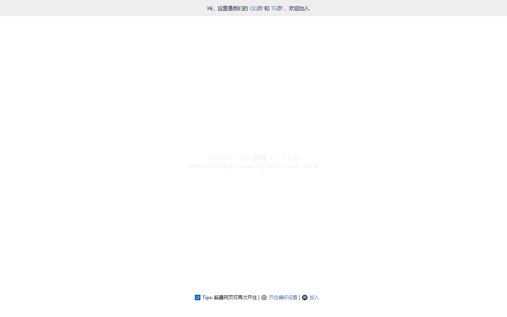

<p align="center">
  
</p>

<h1 align="center">resc.cn</h1>

<p align="center">张小性的个人站点 · 基于 VitePress 与 Curve 主题精心打造</p>

<p align="center">
  <a href="https://resc.cn">🌐 在线访问</a> ·
  <a href="#-特性">✨ 特性</a> ·
  <a href="#-本地运行">🚀 快速开始</a> ·
  <a href="#-后台管理">🛠 后台管理</a> ·
  <a href="#-致谢">🙏 致谢</a>
</p>

<p align="center">
  
  
  
  
  
</p>

---

## 📖 简介

**resc.cn** 是一个用 [VitePress](https://vitepress.dev) 构建的现代化个人站点，采用精美的 [Curve](https://github.com/imsyy/vitepress-theme-curve) 主题并做了大量定制。它既是博客，也是作品与生活的记录地——细腻的排版、流畅的动效、可互动的吉祥物，以及一套可视化的后台管理面板，让内容创作与站点维护都变得轻松。

> 作者：[@张小性](https://resc.cn) · 主题基于 [vitepress-theme-curve](https://github.com/imsyy/vitepress-theme-curve)（by [imsyy](https://github.com/imsyy)）

## ✨ 特性

- 🎨 **精美主题** —— 基于 Curve 主题，细腻排版、暗色模式、流畅过渡动效，阅读体验舒适。
- 🐱 **互动吉祥物「团团」** —— 轻量 2D SVG 实现，可拖拽摆放、眼睛与身体跟随光标、点击弹跳并冒出随机话术，移动端也能愉快互动。
- 🛠 **可视化后台** —— 内置 `resc-admin` 管理面板，点点鼠标即可配置全站设置，无需手改配置文件。
- 🔍 **全文搜索** —— 集成 Algolia，毫秒级检索站内文章与页面。
- 🎵 **音乐播放** —— 内置 APlayer，沉浸式听歌不打断阅读。
- 📱 **PWA 支持** —— 可安装到桌面/手机，离线也能访问。
- 🖼 **文章封面** —— 内置脚本自动生成 / AI 生成封面，省去排版烦恼。
- ⚡ **极速构建** —— Vite 驱动，开发热更新秒级响应，构建产物轻量高效。

## 📸 预览

> 以下为 resc.cn 线上真实页面截图。

<p align="center">
  
  
</p>
<p align="center">
  
</p>
## 🧱 技术栈

| 类别 | 技术 |
| --- | --- |
| 静态站点框架 | [VitePress](https://vitepress.dev) 1.5 |
| 前端框架 | [Vue](https://vuejs.org) 3 |
| 主题 | [vitepress-theme-curve](https://github.com/imsyy/vitepress-theme-curve) |
| 状态管理 | [Pinia](https://pinia.vuejs.org) |
| 样式 | SASS / SCSS |
| 搜索 | Algolia（vue-instantsearch） |
| 音乐 | APlayer |
| PWA | @vite-pwa/vitepress |
| 部署 | Vercel |

## 📂 主要目录

```text
resc.cn/
├── .vitepress/          # VitePress 配置与自定义主题
│   ├── theme/           # Curve 主题定制（组件 / 工具 / 视图）
│   └── init.mjs         # 站点初始化脚本
├── posts/               # 文章（Markdown）
├── pages/               # 独立页面
├── public/              # 静态资源（图片 / favicon / 文章封面）
├── resc-admin/          # 后台管理面板（server.js + 可视化配置）
├── scripts/             # 构建 / 封面生成等脚本
├── package.json
├── themeConfig.mjs      # 主题配置
└── vercel.json          # Vercel 部署配置
```

## 🚀 本地运行

环境要求：**Node.js ≥ 20**，并建议使用 **pnpm**。

```bash
pnpm install        # 安装依赖
pnpm dev            # 启动本地开发服务（默认 http://localhost:5173）
pnpm build          # 构建静态站点到 .vitepress/dist
pnpm preview        # 本地预览构建产物
pnpm deploy:vercel  # 一键部署到 Vercel
```

## 🛠 后台管理

项目内置一个轻量的后台管理面板（`resc-admin/`），通过可视化界面配置站点信息、导航、社交、打赏、文章等设置，保存后写入 `site-settings.json`，配合构建脚本即可上线，无需手动编辑配置文件。

```bash
# 在服务器上以 pm2 常驻运行
pm2 start server.js --name resc-admin
```

> 后台面板为纯静态前端 + 轻量 Node 服务，修改配置后刷新即生效。

## 🙏 致谢

- 主题：[vitepress-theme-curve](https://github.com/imsyy/vitepress-theme-curve) —— 由 [imsyy](https://github.com/imsyy) / [無名小栈](https://blog.imsyy.top/) 打造的精美 VitePress 主题
- 构建工具：[VitePress](https://vitepress.dev)

## 📄 许可证

本项目基于 [MIT](LICENSE) 许可证开源。
